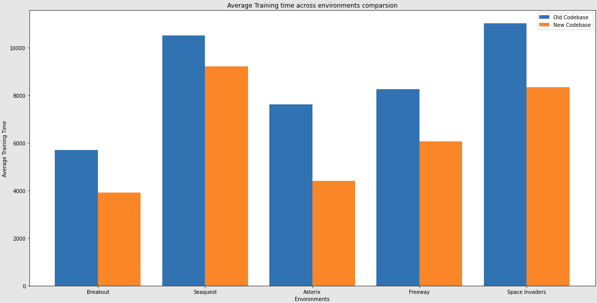
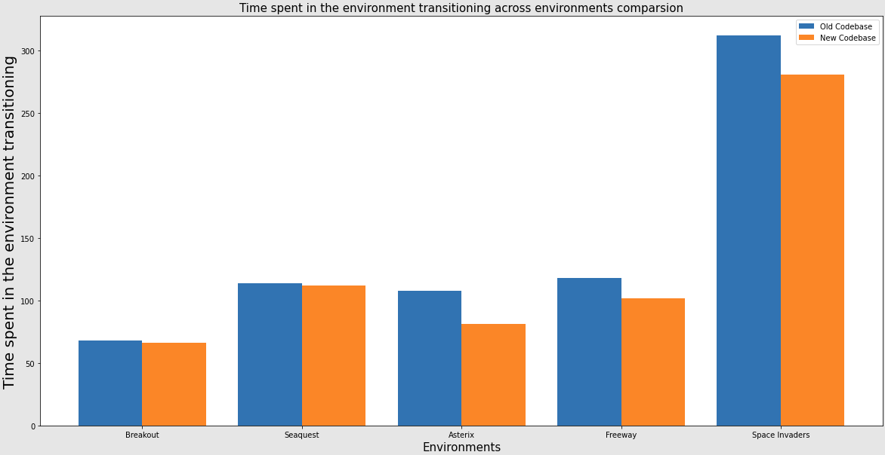
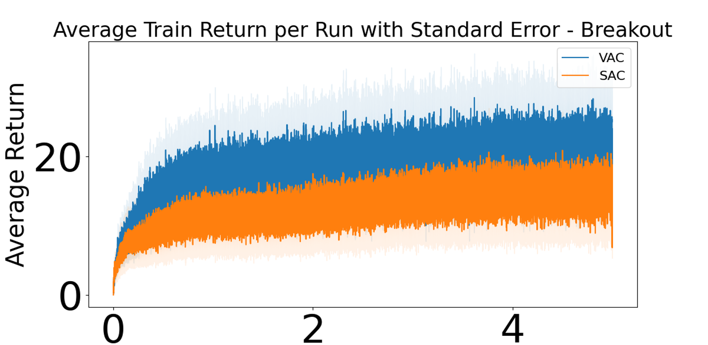
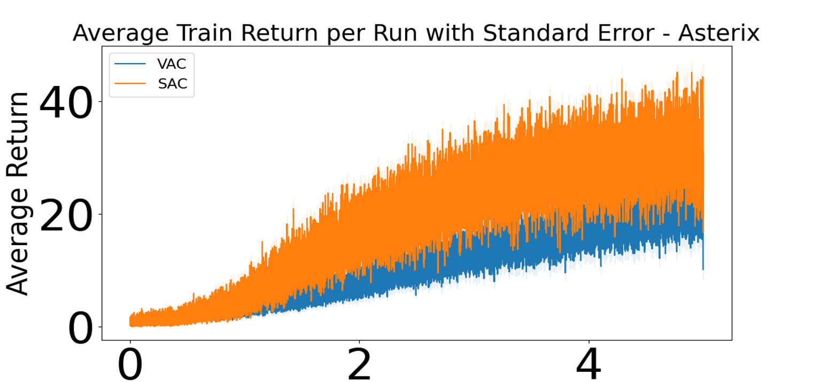

# MinAtar - Faster
MinAtar is a testbed for AI agents which implements miniaturized versions of several Atari 2600 games. MinAtar is inspired by the Arcade Learning Environment (Bellemare et. al. 2013) but simplifies the games to make experimentation with the environments more accessible and efficient. Currently, MinAtar provides analogs to five Atari games which play out on a 10x10 grid. The environments provide a 10x10xn state representation, where each of the n channels corresponds to a game-specific object, such as a ball, paddle and brick in the game Breakout. The codebase has now been optimized (in some cases even JIT compile has been used ) and the training time of various environments has been reduced by at most 50%. We also provide benchmarks of the standard algorithms for the MinAtar games.

<p  align="center">


</p>
<p  align="center">


</p>

## Standard Quick Start
To use MinAtar, you need python3 installed, make sure pip is also up to date.  To run the included `DQN` and `AC_lambda` examples, you need `PyTorch`.  To install MinAtar, please follow the steps below:

1. Clone the repo: 
```bash
git clone https://github.com/Robertboy18/MinAtar-Faster.git
```
If you prefer running MinAtar in a virtualenv, you can do the following before step 2:
```bash
python3 -m venv venv
source venv/bin/activate
# Upgrade Pip
pip install --upgrade pip
```

2.  Install MinAtar:
```bash
pip install .
pip install -r requirements.txt
```
If you have any issues with automatic dependency installation, you can instead install the necessary dependencies manually and run
```bash
pip install . --no-deps
```

To verify the installation is successful, run
```bash
python examples/random_play.py -g breakout
```
The program will run 1000 episodes with a random policy and report the mean and standard error in the resulting returns similar to:
```bash
Avg Return: 0.5+/-0.023194827009486406
```

The examples/random_play.py is a simple example to demonstrate how to use the module. `breakout` in the previous command can be replaced by one of the five available games: asterix, breakout, freeway, seaquest and space_invaders. See the Games section below for details of each game.

To play a game as a human, run examples/human_play.py as follows:

```bash
python human_play.py -g <game>
```
Use the arrow keys to move and space bar to fire. Also, press q to quit and r to reset.

Also included in the examples directory are example implementations of DQN (dqn.py) and online actor-critic with eligibility traces (AC_lambda.py).

## Optimized Code with various Agents Usage

To run your first experiment:
```
python3 main.py --agent-json config/agent/SAC.json --env-json config/environment/AcrobotContinuous-v1.json --index 0
```

# Usage
The file main.py trains an agent for a specified number of runs, based on an environment and agent configuration file count in config/environment/ or config/agent/ respectively. The data is saved in the results directory, with a name similar to the environment and agent name.

For more information on how to use the main.py program, see the `--help` option:
```
Usage: main.py [OPTIONS]

  Given agent and environment configuration files, run the experiment defined
  by the configuration files

Options:
  --env-json TEXT      Path to the environment json configuration file
                       [required]
  --agent-json TEXT    Path to the agent json configuration file  [required]
  --index INTEGER      The index of the hyperparameter to run
  -m, --monitor        Whether or not to render the scene as the agent trains.
  -a, --after INTEGER  How many timesteps (training) should pass before
                       rendering the scene
  --save-dir TEXT      Which directory to save the results file in
  --help               Show this message and exit.
```

Example:
```
./main.py --env-json config/environment/MountainCarContinuous-v0.json --agent-json config/agent/linearAC.json --index 0 --monitor --after 1000
```
will run the experiment using linear-Gaussian actor-critic on the mountain
car environment. The experiment is run on one process (serially), and the
scene is rendered after 1000 timesteps of training. We will only run the
hyperparameter setting with index 0.

# Hyperparameter settings
The hyperparameter settings are laid out in the agent configuration files.
The files are laid out such that each setting is a list of values, and the
total number of hyperparameter settings is the product of the lengths of each
of these lists. For example, if the agent config file looks like:
```
{
    "agent_name": "linearAC",
    "parameters":
    {
        "decay": [0.5],
        "critic_lr": [0.005, 0.1, 0.3],
        "actor_lr": [0.005, 0.1, 0.3],
        "avg_reward_lr": [0.1, 0.3, 0.5, 0.9],
        "scaled": [true],
        "clip_stddev": [1000]
    }
}
```
then, there are `1 x 3 x 3 x 4 x 1 x 1 = 36` different hyperparameter
settings. Each hyperparameter setting is given a specific index. For example
hyperparameter setting index `1` would have the following hyperparameters:
```
{
    "agent_name": "linearAC",
    "parameters":
    {
        "decay": 0.5,
        "critic_lr": 0.005,
        "actor_lr": 0.005,
        "avg_reward_lr": 0.1,
        "scaled": true,
        "clip_stddev": 1000
    }
}
```
The hyperparameter settings indices are actually implemented `mod x`,
where `x` is the maximum number of hyperparameter settings (in the example
about, `36`). So, in the example above, the hyperparameter settings with
indices `1, 37, 73, ...` all refer to the same hyperparameter settings since
`1 = 37 = 73 = ... mod 36`. The difference is that the consecutive indices
have a different seed. So, each time we run experiments with hyperparameter
setting `1`, it will have the same seed. If we run with hyperparameter setting
`37`, it will be the same hyperparameter settings as `1`, but with a different
seed, and this seed will be the same every time we run the experiment with
hyperparameter settings `37`. This is what Martha and her students
have done with their Actor-Expert implementation, and I find that it works
nicely for hyperparameter sweeps.


# Saved Data
Each experiment saves all the data as a Python dictionary. The dictionary is
designed so that we store all information about the experiment, including all
agent hyperparameters and environment settings so that the experiment is
exactly reproducible.

If the data dictionary is called `data`, then the main data for the experiment
is stored in `data["experiment_data"]`, which is a dictionary mapping from
hyperparameter settings indices to agent parameters and experiment runs.
`data["experiment_data"][i]["agent_params"]` is a dictionary storing the
agent's hyperparameters (hyperparameter settings index `i`) for the experiment.
`data["experiment_data"][i]["runs]` is a list storing the runs for the
`i-th` hyperparameter setting. Each element of the list is a dictionary, giving
all the information for that run and hyperparameter setting. For example,
`data["experiment_data"][i]["runs"][j]` will give all the information on
the `j-th` run of hyperparameter settings `i`.

Below is a tree diagram of the data structure:
```
data
├─── "experiment"
│       ├─── "environment": environment configuration file
│       └─── "agent": agent configuration file
└─── "experiment_data": dictionary of hyperparameter setting *index* to runs
        ├─── "agent_params": the hyperparameters settings
        └─── "runs": a list containing all the runs for this hyperparameter setting (each run is a dictionary of elements)
                └─── index i: information on the ith run
                		├─── "run_number": the run number
                        ├─── "random_seed": the random seed used for the run
                        ├─── "total_timesteps": the total number of timesteps in the run
                        ├─── "eval_interval_timesteps": the interval of timesteps to pass before running offline evaluation
                        ├─── "episodes_per_eval": the number of episodes run at each offline evaluation
                        ├─── "eval_episode_rewards": list of the returns (np.array) from each evaluation episode if there are 10 episodes per eval,
                        │     then this will be a list of np.arrays where each np.array has 10 elements (one per eval episode)
                        ├─── "eval_episode_steps": the number of timesteps per evaluation episode, with the same form as "eval_episode_rewards"
                        ├─── "timesteps_at_eval": the number of training steps that passed at each evaluation. For example, if there were 10
                        │    offline evaluations, then this will be a list of 10 integers, each stating how many training steps passed before each
                        │    evaluation.
                        ├─── "train_episode_rewards": the return seen for each training episode
                        ├─── "train_episode_steps": the number of timesteps passed for each training episode
                        ├─── "train_time": the total amount of training time in seconds
                        ├─── "eval_time": the total amount of evaluation time in seconds
                        └─── "total_train_episodes": the total number of training episodes for the run
```

For example, here is `data["experiment_data"][i]["runs"][j]` for a mock run
of the Linear-Gaussian Actor-Critic agent on MountainCarContinuous-v0:
```
{'random_seed': 0,
 'total_timesteps': 1000,
 'eval_interval_timesteps': 500,
 'episodes_per_eval': 10,
 'eval_episode_rewards': array([[-200., -200., -200., -200., -200., -200., -200., -200., -200.,
         -200.],
        [-200., -200., -200., -200., -200., -200., -200., -200., -200.,
         -200.]]),
 'eval_episode_steps': array([[200, 200, 200, 200, 200, 200, 200, 200, 200, 200],
        [200, 200, 200, 200, 200, 200, 200, 200, 200, 200]]),
 'timesteps_at_eval': array([  0, 600]),
 'train_episode_steps': array([200, 200, 200, 200, 200]),
 'train_episode_rewards': array([-200., -200., -200., -200., -200.]),
 'train_time': 0.12098526954650879,
 'eval_time': 0.044415950775146484,
 'total_train_episodes': 5,
 ...}
```

# Configuration files
Each configuration file is a JSON file and has a few properties. There
are also templates in each configuration directory for the files.

## Environment Configuration File
```
{
    "env_name": "environment filename without .json, all files refer to this as env_name",
    "total_timesteps": "int - total timesteps for the entire run",
    "steps_per_episode": "int - max number of steps per episode",
    "eval_interval_timesteps": "int - interval of timesteps at which offline evaluation should be done",
    "eval_episodes": "int - the number of offline episodes per evaluation",
    "gamma": "float - the discount factor",
}
```

## Agent Configuration File
The agent configuration file is more general. The template is below. Since
both agents already have configuration files, there is not much need to add
any new configurations for agents. Instead, it would suffice to alter the
existing configuration files. The issue is that each agent has very different
configurations and hyperparameters, and so the config files are very different.
```
{
    "agent_name": "filename without .json, all code refers to this as agent_name",
    "parameters":
    {
        "parameter name": "list of values"
    }
}
```

## OpenAI Gym Wrapper
MinAtar now includes an OpenAI Gym plugin using the Gym plugin system. If a sufficiently recent version of OpenAI gym (`pip install gym==0.21.0` works) is installed, this plugin should be automatically available after installing MinAtar as normal. A gym environment can then be constructed as follows:
```bash
import gym
env = gym.make('MinAtar/<game>')
````
where game is one of: Asterix-v0, Breakout-v0, Freeway-v0, Seaquest-v0, SpaceInvaders-v0, Asterix-v1, Breakout-v1, Freeway-v1, Seaquest-v1, SpaceInvaders-v1. For each game, v0 specifies the version with all 6 actions available (some of which are equivalent to no-op depending on the game), while v1 specifies the version which uses the minimal action set for the game. Note that the results included in this repo and the associated paper use the full action set of 6 actions.

## Visualizing the Environments
We provide 2 ways to visualize a MinAtar environment.
### Using Environment.display_state()
The Environment class includes a simple visualizer using matplotlib in the display_state function. To use this simply call:
```python
env.display_state(50)
```
where env is an instance of MinAtar.Environment. The argument is the number of milliseconds to display the state before continuing execution. To close the resulting display window call:
```python
env.close_display()
```
This is the simplest way to visualize the environments, unless you need to handle user input during execution in which case you could use the provided GUI class.


### Using GUI class
We also include a slightly more complex GUI to visualize the environments and optionally handle user input. This GUI is used in examples/human_play.py to play as a human and examples/agent_play.py to visualize the performance of trained agents. To use the GUI you can import it in your code with:
```python
from minatar.gui import GUI
```
Initialize an instance of the GUI class by providing a name for the window, and the integer number of input channels for the minatar environment to be visualized. For example:
```python
GUI(env.game_name(), env.n_channels)

```
where env is an instance of minatar.Environment. The recommended way to use the GUI for visualizing an environment is to include all you're agent-environment interaction code in a function that looks something like this:
```python
def func():
    gui.display_state(env.state())
    #One step of agent-environment interaction here
    gui.update(50, func)
```
The first argument to gui.update is the time to hold the current frame before continuing. The second argument specifies the function to call after that time has elapsed. In the example above the call to update simply calls func again, effectively continuing the agent-environment interaction loop. Note that this is not a recursive call, as the call to func in update is made in a new thread, while the execution of the current thread continues.

To begin the execution you can use:
```python
gui.update(0, func)
gui.run()
```
This will enter the agent environment interaction loop and then run the GUI thread, gui.run() will block until gui.quit() is called. To handle user input you can use gui.overwrite_key_handle(on_key_event, on_release_event). The arguments are functions to be called whenever a key is pressed, and released respectively. For an example of how to do this see examples/human_play.py.

## Support for Other Languages

- [Julia](https://github.com/mkschleg/MinAtar.jl/blob/master/README.md)
- [Go](https://github.com/samuelfneumann/GoAtar)


## Training Time results
The following plots display results that compares the Average training time across the various environments between the old codebase (MinAtar) and the new codebase (MinAtar - Faster). The environments were trained on the Soft Actor Critic agent on a fixed hyperparameter setting which was chosen randomly. We trained SAC on 1.5 Million frames and 2500 steps per episode.



The results for the average time spent in the environment transitioning per step across the various environments comparing the codebase are shown below.



## Results
The following plots display results for DQN (Mnih et al., 2015) and actor-critic (AC) with eligibility traces. Our DQN agent uses a significantly smaller network compared to that of Mnih et al., 2015. We display results for DQN with and without experience replay. Our AC agent uses a similar architecture to DQN, but does not use experience replay. We display results for two values of the trace decay parameter, 0.8 and 0.0.  Each curve is the average of 30 independent runs with different random seeds. The top plots display the sensitivity of final performance to the step-size parameter, while the bottom plots display the average return during training as a function of training frames. For further information, see the paper on MinAtar available [here](https://arxiv.org/abs/1903.03176).


Additionally some of the benchmarks results are shown below. The comparison is between the Soft actor-critic agent and a base model ie a Vanilla actor-critic agent. (SAC vs VAC). The agents were trained on 5 Million frames and 2500 steps per episode to compare against the original benchmark in MinAtar as well as used a new-hyperparamater approach to report the mean learning curves. The new proposed approach is part of an ongoing paper which is soon to be published, and the details will be revealed soon. The rest of the environments results are in the process of training and will be added as soon as they are ready.






## Games
So far we have implemented analogs to five Atari games in MinAtar as follows. For each game, we include a link to a video of a trained DQN agent playing.

### Asterix
The player can move freely along the 4 cardinal directions. Enemies and treasure spawn from the sides. A reward of +1 is given for picking up treasure. Termination occurs if the player makes contact with an enemy. Enemy and treasure directions are indicated by a trail channel. The difficulty is periodically increased by increasing the speed and spawn rate of enemies and treasure.

[Video](https://www.youtube.com/watch?v=Eg1XsLlxwRk)

### Breakout
The player controls a paddle on the bottom of the screen and must bounce a ball to break 3 rows of bricks along the top of the screen. A reward of +1 is given for each brick broken by the ball.  When all bricks are cleared another 3 rows are added. The ball travels only along diagonals. When the ball hits the paddle it is bounced either to the left or right depending on the side of the paddle hit. When the ball hits a wall or brick, it is reflected. Termination occurs when the ball hits the bottom of the screen. The ball's direction is indicated by a trail channel.

[Video](https://www.youtube.com/watch?v=cFk4efZNNVI&t)

### Freeway
The player begins at the bottom of the screen and the motion is restricted to traveling up and down. Player speed is also restricted such that the player can only move every 3 frames. A reward of +1 is given when the player reaches the top of the screen, at which point the player is returned to the bottom. Cars travel horizontally on the screen and teleport to the other side when the edge is reached. When hit by a car, the player is returned to the bottom of the screen. Car direction and speed are indicated by 5 trail channels.  The location of the trail gives direction while the specific channel indicates how frequently the car moves (from once every frame to once every 5 frames). Each time the player successfully reaches the top of the screen, the car speeds are randomized. Termination occurs after 2500 frames have elapsed.

[Video](https://www.youtube.com/watch?v=gbj4jiTcryw)

### Seaquest
The player controls a submarine consisting of two cells, front and back, to allow the direction to be determined. The player can also fire bullets from the front of the submarine. Enemies consist of submarines and fish, distinguished by the fact that submarines shoot bullets and fish do not. A reward of +1 is given each time an enemy is struck by one of the player's bullets, at which point the enemy is also removed. There are also divers that the player can move onto to pick up, doing so increments a bar indicated by another channel along the bottom of the screen. The player also has a limited supply of oxygen indicated by another bar in another channel. Oxygen degrades over time and is replenished whenever the player moves to the top of the screen as long as the player has at least one rescued diver on board. The player can carry a maximum of 6 divers. When surfacing with less than 6, one diver is removed. When surfacing with 6, all divers are removed and a reward is given for each active cell in the oxygen bar. Each time the player surfaces the difficulty is increased by increasing the spawn rate and movement speed of enemies. Termination occurs when the player is hit by an enemy fish, sub or bullet; when oxygen reaches 0; or when the player attempts to surface with no rescued divers. Enemy and diver directions are indicated by a trail channel active in their previous location to reduce partial observability.

[Video](https://www.youtube.com/watch?v=W9k38b5QPxA&t)

### Space Invaders
The player controls a cannon at the bottom of the screen and can shoot bullets upward at a cluster of aliens above. The aliens move across the screen until one of them hits the edge, at which point they all move down and switch directions. The current alien direction is indicated by 2 channels (one for the left and one for the right) one of which is active at the location of each alien. A reward of +1 is given each time an alien is shot, and that alien is also removed. The aliens will also shoot bullets back at the player. When few aliens are left, alien speed will begin to increase. When only one alien is left, it will move at one cell per frame. When a wave of aliens is fully cleared, a new one will spawn which moves at a slightly faster speed than the last. Termination occurs when an alien or bullet hits the player.

[Video](https://www.youtube.com/watch?v=W-9Ru-RDEoI)

## Citing MinAtar - Faster
If you use MinAtar - Faster in your research please cite the following:

Young, K. Tian, T. (2019). MinAtar: An Atari-Inspired Testbed for Thorough and Reproducible Reinforcement Learning Experiments.  *arXiv preprint arXiv:1903.03176*.

Joseph, Robert, et al. “Making Reinforcement Learning Experiments More Reproducible and Computationally Efficient.” Undergraduate Research Symposium, University of Alberta, 2022, pp. 15–16.

In BibTeX format:

```
@Article{young19minatar,
author = {{Young}, Kenny and {Tian}, Tian},
title = {MinAtar: An Atari-Inspired Testbed for Thorough and Reproducible Reinforcement Learning Experiments},
journal = {arXiv preprint arXiv:1903.03176},
year = "2019"
}
```
and 
```
@Article{minatarfaster,
author = {{George}, Robert Joseph and {Neumann}, Samuel and {White}, Martha and {White}, Adam},
title = {Making Reinforcement Learning Experiments More Reproducible and Computationally Efficient.},
year = "2022"
}
```

## Special thanks

[Samuel Neumann](https://github.com/samuelfneumann) for all the help he has given me with this research over the summer.

Professor [Martha White](https://webdocs.cs.ualberta.ca/~whitem/) for letting me do this research over the summer at the Reinforcement Learning and Artificial Intelligence Lab (RLAI) and at the Alberta Machine Intelligence Institute (Amii).

## Future Work
Compare various other algorithms such as DQN to Double DQN and produce more benchmarks.

Prove theoretical guarantees on the new proposed Hyperparameter approach.

Add more environments to MinAtar.

Implement this in other languages.

## References
Bellemare, M. G., Naddaf, Y., Veness, J., & Bowling, M. (2013). The arcade learning environment: An evaluation platform for general agents. *Journal of Artificial Intelligence Research*, 47, 253–279.

Mnih, V., Kavukcuoglu, K., Silver, D., Rusu, A. A., Veness, J., Bellemare, M. G., . . . others (2015). Human-level control through deep reinforcement learning. *Nature*, 518(7540), 529.

## License
This program is free software: you can redistribute it and/or modify
it under the terms of the GNU General Public License as published by
the Free Software Foundation, either version 3 of the License, or
(at your option) any later version.

This program is distributed in the hope that it will be useful,
but WITHOUT ANY WARRANTY; without even the implied warranty of
MERCHANTABILITY or FITNESS FOR A PARTICULAR PURPOSE.  See the
GNU General Public License for more details.

You should have received a copy of the GNU General Public License
along with this program.  If not, see <http://www.gnu.org/licenses/>.
